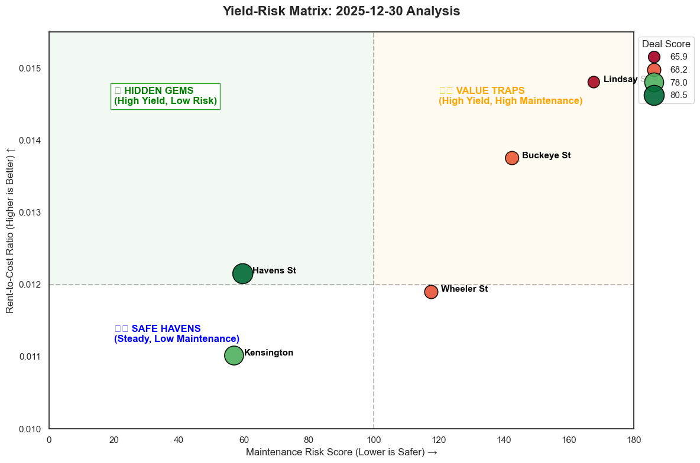

# 🏠 Real Estate Yield-Risk Optimizer

**An automated data pipeline that identifies high-yield rental properties while filtering out "value traps" (high maintenance risk).**

## 🎯 The Business Problem
High "Rent-to-Cost" ratios often lure investors into bad deals. A property might show a 1.5% yield, but if it's 100 years old and in a labor-scarce market, the **Effective Yield** is much lower due to maintenance costs.

## 🛠️ The Solution
This pipeline ingests live market data and scores properties on a "Deal Score" (0-100) using a custom algorithm:
* **Yield (40%):** Standard Rent-to-Cost Ratio.
* **Safety (40%):** A custom "Maintenance Risk Score" (Age × Size × Labor Index).
* **Stability (20%):** Vacancy-Adjusted Revenue.

## 🚀 How It Works (The Pipeline)
1.  **Extraction:** Pulls live listings from RentCast API.
2.  **Preprocessing:** Cleans data and removes non-investment types (e.g., Land).
3.  **Enrichment:** "Sniper" approach—fetches rent estimates only for top candidates (saves API costs).
4.  **Feature Engineering:** Calculates Risk Scores and Adjusted Revenue.
5.  **Scoring:** Normalizes metrics and ranks the "Top 5 Deals."
6.  **Visualization:** Automatically generates a quadrant chart for analysis.

## 📊 Visualization
The pipeline automatically generates a "Yield-Risk Matrix" to separate high-potential deals (Green) from value traps (Orange).



## 💻 Tech Stack
* **Python 3.10+**
* **Pandas:** Data manipulation.
* **Requests:** API interaction.
* **PyYAML:** Configuration management.
* **Seaborn/Matplotlib:** Visualization.

## 🏁 Quick Start
1.  Clone the repo.
2.  Create a `.env` file with your `RENTCAST_API_KEY`.
3.  Run the full pipeline:
    ```bash
    python main.py
    ```
4.  View results in `data/04-predictions/`.
